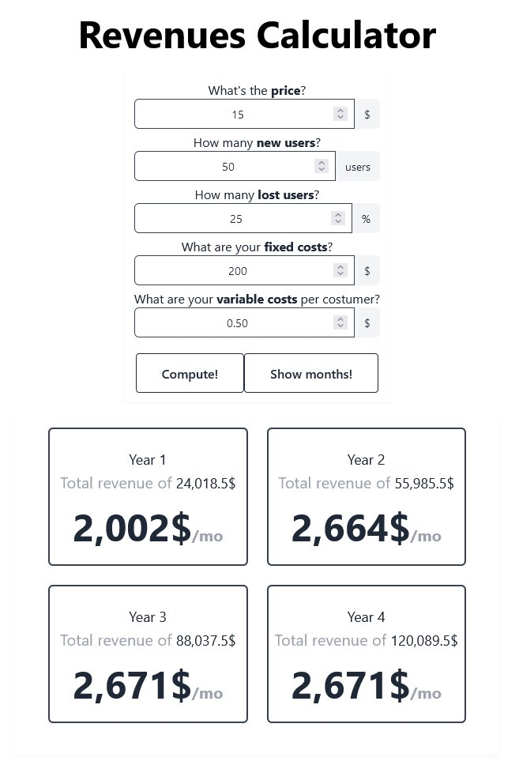

# revenues-calc
Revenues calculator for a recurring payment-type service. 
This webapp computes how much revenue you would gain per month and per year, given the estimated new and lost costumers, the service prices and management costs.

Try it here:
revenues-calc.netlify.app

## How was it built?
This webapp was built using the [Astro Web Framework](https://astro.build/), [Tailwind CSS](https://tailwindcss.com/) for CSS styling and [React](https://react.dev/) for the dynamic components. 

## Commands

All commands are run from the root of the project, from a terminal:

| Command                | Action                                           |
| :--------------------- | :----------------------------------------------- |
| `npm install`          | Installs dependencies                            |
| `npm run dev`          | Starts local dev server at `localhost:3000`      |
| `npm run build`        | Build your production site to `./dist/`          |
| `npm run preview`      | Preview your build locally, before deploying     |
| `npm run astro ...`    | Run CLI commands like `astro add`, `astro check` |
| `npm run astro --help` | Get help using the Astro CLI                     |

